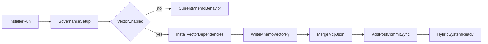

# Inline Hybrid Vector Patch (Windows + macOS)

## Objective

Add a robust semantic vector layer directly into the current installers, without changing Mnemo governance behavior (lessons/journal/lint/rules) when vector mode is not enabled.

## Files in Scope

- [memory.ps1](f:/Projects/mantisbt-2.25.6/Mnemo/memory.ps1)
- [memory_mac.sh](f:/Projects/mantisbt-2.25.6/Mnemo/memory_mac.sh)

## Planned Changes

### 1) Add optional vector mode flags (non-breaking defaults)

- In [memory.ps1](f:/Projects/mantisbt-2.25.6/Mnemo/memory.ps1): add `-EnableVector` and `-VectorProvider openai|gemini` params.
- In [memory_mac.sh](f:/Projects/mantisbt-2.25.6/Mnemo/memory_mac.sh): add `--enable-vector` and `--vector-provider openai|gemini` args.
- Keep default behavior identical to current system when vector mode is off.

### 2) Generate `mnemo_vector.py` from both installers (inline integration)

- Add a new embedded Python template in both installers that writes `scripts/memory/mnemo_vector.py`.
- Include fixes discussed in review:
  - Partial-index safety (`DIRTY` state + retry) instead of false clean hashes.
  - Heading-aware chunking + lesson atomic chunking + journal date chunking.
  - SQLite WAL + schema metadata checks.
  - MCP SDK compatibility import (`MCPServer` first, fallback to `FastMCP`) to avoid version breakage.
  - Provider abstraction for OpenAI/Gemini with explicit error messages when keys are missing.

### 3) Dependency install path (only when vector mode enabled)

- Add guarded dependency installation blocks in both installers with strict exit-code checks.
- Prefer stable `python -m pip install` / `python3 -m pip install` for:
  - `openai`, `sqlite-vec`, `mcp[cli]`
  - `google-genai` only if Gemini provider is selected.
- If vector mode is requested and dependencies fail, fail fast with a clear message (do not silently report success).

### 4) Additive MCP config merge (no overwrite)

- Implement merge logic for `.cursor/mcp.json` in both installers:
  - Preserve existing servers.
  - Add/update `MnemoVector` server only.
  - Store env references (`${env:...}` / `${...}` style placeholders), never raw secrets.

### 5) Hook integration without breaking existing pre-commit behavior

- Keep existing pre-commit rebuild/lint hooks unchanged.
- Add a separate post-commit vector sync block (or managed marker block) in `.githooks/post-commit`.
- Ensure append/update logic is idempotent and safe even if existing hook contains `exit 0`.
- Use quoted Python executable path and cross-platform lock strategy (`mkdir` lockdir + stale-lock cleanup).

### 6) Update `.gitignore` and rules additively

- Add vector DB artifacts only (`mnemo_vector.sqlite*`, lock dir file/dir patterns).
- Add `.cursor/rules/01-vector-search.mdc` without touching `00-memory-system.mdc`.
- Update installer completion output to show optional vector commands and fallback behavior.

### 7) Verification after patch

- Syntax/smoke checks:
  - Python compile check for generated `mnemo_vector.py`.
  - Installer argument path checks (Windows/mac).
  - Confirm MCP JSON remains valid after merge.
- Lint check for touched files via project lints.

## Integration Flow

## Expected Outcome

- Current Mnemo governance workflow remains intact.
- Optional semantic search is available via MCP when enabled/configured.
- No silent failures on dependencies or hook execution paths.
- Windows and macOS installers stay behaviorally aligned.

